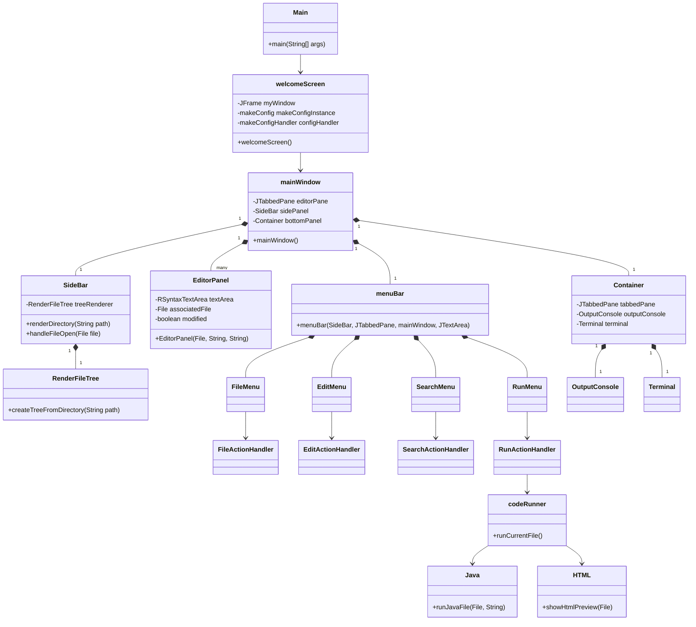
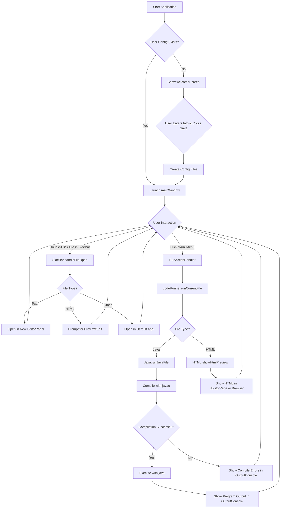

# C-IDE: A Lightweight Java-Based IDE

C-IDE is a lightweight, extensible Integrated Development Environment (IDE) built with Java Swing. It aims to provide a simple yet powerful coding experience with e- **Key Methods:** - `showHtmlPreview(File file)`: Displays the HTML file in a new tab within the IDE. - `openFileInDefaultBrowser(File file)`: Opens the HTML file in the system's default web browser.

## Application Architecture Diagrams

### Class Diagram



### Application Flowchart



ntial features for software development.

## Table of Contents

1.  [Core Components](#core-components)
    - [Onboarding (`welcomeScreen.java`)](#onboarding-welcomescreenjava)
2.  [Features](#features)
3.  [Getting Started](#getting-started)
4.  [Tech Stack](#tech-stack)

---

## Core Components

This section details the main components of the C-IDE application.

### Onboarding (`welcomeScreen.java`)

The `welcomeScreen` is the initial entry point for users interacting with C-IDE for the first time. Its primary responsibility is to handle the user onboarding process, ensuring a smooth setup experience.

#### Purpose and Functionality

- **User Onboarding:** For new users, the `welcomeScreen` presents a setup dialog to configure essential settings.
- **Configuration:** It prompts the user for two key pieces of information:
  1.  **User Name:** To personalize the experience.
  2.  **IDE Home Path:** The directory where C-IDE will store its configuration files and user data.
- **State Management:** The class checks if a user has been previously configured by looking for a meta-configuration file (`chax_ide_config.path`).
  - If the file exists, it reads the `IDE_HOME_PATH` and proceeds to launch the main IDE (`mainWindow`).
  - If the file does not exist, it displays the welcome and setup screen.
- **Delegation of Concerns:** To maintain a clean architecture, the `welcomeScreen` delegates specific responsibilities to other classes:
  - **UI Construction (`makeConfig.java`):** The `makeConfig` class is responsible for creating and laying out the Swing components of the welcome screen (text fields, labels, buttons).
  - **Event Handling (`makeConfigHandler.java`):** The `makeConfigHandler` class manages user interactions, such as button clicks for selecting the home path and saving the configuration.
  - **Configuration I/O (`configReader.java` and `configWriter.java`):** These classes handle the reading and writing of configuration data from and to the file system.

#### Technical Details

- **Entry Point:** The application's `Main` class instantiates `welcomeScreen`.
- **Configuration Files:**
  - `chax_ide_config.path`: A meta-file that stores the path to the IDE's home directory. This allows the IDE to find its configuration files on subsequent launches.
  - `data.txt`: Located within the IDE's home directory, this file stores user-specific information like the username.
- **Class Dependencies:**
  - `javax.swing.*`: For all UI components.
  - `utils.*`: A utility package containing the helper classes (`makeConfig`, `makeConfigHandler`, `configReader`, etc.).

### Main IDE Window (`mainWindow.java`)

The `mainWindow` class is the central hub of the C-IDE, providing the main graphical user interface where all other components are integrated. It extends `JFrame` and orchestrates the layout and interaction of the side panel, editor pane, and bottom container.

#### Purpose and Functionality

- **Main Application Frame:** Serves as the top-level container for the entire IDE.
- **Component Integration:** It initializes and arranges the three main visual sections of the IDE:
  1.  **`SideBar`:** A panel on the left that displays the file system hierarchy of the opened project.
  2.  **`JTabbedPane` (editorPane):** The central area where files are opened in tabs for editing.
  3.  **`Bottom.Container`:** A panel at the bottom that contains the output console and terminal.
- **Menu Bar:** It sets up the main menu bar (`menuBar.java`), which provides access to all of the IDE's features (File, Edit, Search, Run, etc.).
- **Window Properties:** Configures the properties of the main window, including its size, title, icon, and default close operation.

#### Technical Details

- **Layout:** The `mainWindow` uses a `null` layout, with the bounds of each component set explicitly. This provides precise control over the positioning of the panels.
- **Class Dependencies:**
  - `javax.swing.*`: For the main frame and other UI components.
  - `Bottom.*`: For the bottom container that holds the output and terminal.
  - `codeEditor.EditorPanel`: For the individual editor tabs.
  - `menu.menuBar`: For the main menu.
  - `sideBar.SideBar`: For the file tree view.
  - `utils.*`: For configuration and utility classes.
  - `org.fife.ui.rsyntaxtextarea.*`: For the `RSyntaxTextArea`, which provides syntax highlighting and other advanced editor features.
- **Key Methods:**
  - `mainWindow()`: The constructor that initializes all the UI components and sets up the main window.
  - `findOpenFileTab(File file)`: A utility method to check if a file is already open in one of the editor tabs, preventing duplicate tabs.

### Menu Bar (`menuBar.java` and Menu Classes)

The `menuBar` class, along with the other classes in the `menu` package, creates the main menu system for the IDE. This is the primary way users access the various features and commands.

#### Purpose and Functionality

- **Centralized Command Access:** The menu bar provides a familiar, organized way for users to find and execute commands.
- **Modular Menu Structure:** The menu bar is composed of several individual `JMenu` components, each responsible for a specific category of actions:
  - `FileMenu`: Handles file-related operations like new, open, save, and exit.
  - `EditMenu`: Provides text editing commands like cut, copy, and paste.
  - `SearchMenu`: Contains search-related actions like find and replace.
  - `RunMenu`: Allows the user to execute code.
  - `HelpMenu`: Displays information about the IDE.
  - `ThemeMenu`: Allows the user to change the visual theme of the IDE.
- **Action Handling:** Each menu class (e.g., `FileMenu`) creates and manages its own `JMenuItem`s. The actual logic for what happens when a menu item is clicked is delegated to a corresponding "Action Handler" class (e.g., `FileActionHandler`). This separation of concerns keeps the UI code clean and the business logic organized.

#### Technical Details

- **Inheritance:** The `menuBar` class extends `JMenuBar`. Each individual menu (e.g., `FileMenu`) extends `JMenu`.
- **Composition:** The `menuBar` is composed of instances of the other menu classes.
- **Action Listeners:** Each `JMenuItem` has an `ActionListener` that calls a method in the appropriate action handler class.
- **Class Dependencies:**
  - `javax.swing.*`: For all menu and UI components.
  - `IDE.mainWindow`: The main window is passed to the menus to allow them to interact with other components of the IDE.
  - `sideBar.SideBar`: The side panel is passed to the `FileMenu` to allow it to interact with the file tree.
  - `JTabbedPane`: The editor pane is passed to several menus to allow them to interact with the open files.

### Code Editor (`EditorPanel.java`)

The `EditorPanel` is the heart of the C-IDE, providing the text editing capabilities for files. Each tab in the main editor pane is an instance of `EditorPanel`.

#### Purpose and Functionality

- **Text Editing:** Provides a rich text editing component with features like syntax highlighting, code folding, and line numbers.
- **File Association:** Each `EditorPanel` is associated with a specific `File` object, allowing it to track the file's path and content.
- **Modification Tracking:** The `EditorPanel` keeps track of whether the file has been modified since it was last saved. This is indicated by an asterisk (\*) in the tab title.
- **Syntax Highlighting:** It uses the `RSyntaxTextArea` library to provide syntax highlighting for various programming languages. The syntax style is determined by the file extension.
- **Undo/Redo:** Each `EditorPanel` has its own `UndoManager` to handle undo and redo operations for that specific file.
- **Info Panel:** A small panel at the bottom of the editor displays information about the current file, such as the language and column count.

#### Technical Details

- **Inheritance:** `EditorPanel` extends `JPanel`.
- **Composition:** It contains an `RSyntaxTextArea` for the text editing component and an `RTextScrollPane` to provide scrolling and line numbers.
- **Document Listener:** A `DocumentListener` is attached to the text area's document to detect changes and set the `modified` flag.
- **Class Dependencies:**
  - `javax.swing.*`: For UI components.
  - `org.fife.ui.rsyntaxtextarea.*`: The core library for the syntax-highlighting text area.
  - `utils.handleFiles`: A utility class used to determine the syntax style from the file extension.
- **Key Methods:**
  - `EditorPanel(File file, String content, String syntaxStyle)`: The constructor that creates a new editor tab for a given file.
  - `isModified()`: Returns whether the file has been modified.
  - `getTextArea()`: Returns the underlying `RSyntaxTextArea` component.
  - `getAssociatedFile()`: Returns the `File` object associated with the panel.
  - `setModified(boolean modified)`: Sets the modified status and updates the tab title.

### Side Bar and File Tree (`SideBar.java` and `RenderFileTree.java`)

The `SideBar` and `RenderFileTree` classes work together to provide the file explorer functionality on the left side of the IDE.

#### Purpose and Functionality

- **File System Navigation:** The primary purpose of the side bar is to display the file and directory structure of the currently opened project, allowing the user to navigate and open files.
- **Project Rendering:** The `SideBar` class is responsible for rendering the project directory. It uses the `RenderFileTree` class to create a `JTree` component that displays the file hierarchy.
- **File Opening:** When a user double-clicks on a file in the tree, the `handleFileOpen` method is called. This method determines how to open the file:
  - If the file is already open in a tab, it simply switches to that tab.
  - If it's an HTML file, it prompts the user to open it in the editor, a preview pane, or both.
  - If it's a text-based file, it opens it in a new editor tab.
  - If it's a non-text file (e.g., an image), it attempts to open it in the system's default application.
- **Refreshing:** The side bar can be refreshed to reflect changes in the file system.
- **Project Switching:** The `switchProject` method allows the user to open a different project directory in the file explorer.

#### Technical Details

- **Inheritance:** `SideBar` extends `JPanel`.
- **Composition:** The `SideBar` contains a `RenderFileTree` instance, which in turn creates and manages the `JTree`.
- **File Open Callback:** The `RenderFileTree` class takes a callback function in its constructor (`this::handleFileOpen`). This is a clean way to decouple the file tree rendering from the file opening logic.
- **Class Dependencies:**
  - `javax.swing.*`: For UI components.
  - `IDE.mainWindow`: The main window is passed to the side bar to allow it to interact with the editor pane.
  - `codeEditor.Tabs`: A helper class for creating new editor tabs.
  - `execution.HTML`: Used for previewing HTML files.
  - `utils.*`: For file handling and configuration.
- **Key Methods:**
  - `renderDirectory(String directoryPath)`: Renders the file tree for a given directory.
  - `handleFileOpen(File file)`: The callback method that handles the logic for opening a file.
  - `refreshFileExplorer()`: Refreshes the file tree to show the current state of the project directory.

### Code Execution (`execution` package)

The `execution` package is responsible for running the user's code. It contains a main `codeRunner` class that delegates to language-specific runner classes.

#### `codeRunner.java`

This class is the main entry point for executing code. It determines the file type and delegates to the appropriate runner.

- **Purpose and Functionality:**
  - **Run Current File:** The `runCurrentFile` method is the primary method, which gets the currently active file from the editor pane.
  - **Unsaved Changes:** It checks if the current file has unsaved changes and prompts the user to save before running.
  - **Temporary Files:** If the current file is untitled (has not been saved to disk), it creates a temporary file to run.
  - **File Type Delegation:** It inspects the file extension and calls the appropriate language-specific runner (`Java` or `HTML`).
  - **Output Handling:** It clears the output console before each run and appends the output from the executed process.
- **Technical Details:**
  - **Dependencies:** It depends on `mainWindow`, `JTabbedPane`, and `JTextArea` to interact with the main UI components. It also uses the `Java` and `HTML` runner classes.
  - **Key Methods:**
    - `runCurrentFile()`: The main method to initiate the run process.
    - `executeFile(File fileToRun, String fileContent)`: The method that performs the delegation to the language-specific runners.
    - `prepareFileForRunning(EditorPanel editorPanel)`: Handles the creation of temporary files for unsaved documents.

#### `Java.java`

This class handles the compilation and execution of Java files.

- **Purpose and Functionality:**
  - **Compilation:** It uses the system's Java compiler (`javac`) to compile the `.java` file into a `.class` file. The output of the compiler (errors and warnings) is redirected to the IDE's output console.
  - **Execution:** If the compilation is successful, it uses the `java` command to run the compiled class. The output of the running program is also redirected to the output console.
  - **Process Management:** It uses `ProcessBuilder` to create and manage the `javac` and `java` processes.
- **Technical Details:**
  - **Dependencies:** `ProcessBuilder` for running external commands.
  - **Key Methods:**
    - `runJavaFile(File fileToRun, String fileContent)`: The main method that orchestrates the compilation and execution process.

#### `HTML.java`

This class handles the previewing of HTML files.

- **Purpose and Functionality:**
  - **HTML Preview:** It provides a way to view HTML files directly within the IDE. It can open the HTML file in a `JEditorPane` inside a new tab, or it can open it in the system's default web browser.
- **Technical Details:**
  - **Dependencies:** `JEditorPane` for rendering HTML, and `Desktop.getDesktop().browse()` for opening in the default browser.
  - **Key Methods:**
    - `showHtmlPreview(File file)`: Displays the HTML file in a new tab within the IDE.
    - `openFileInDefaultBrowser(File file)`: Opens the HTML file in the system's default web browser.

# Chax IDE Documentation

## 1. Overview

Welcome to the Chax IDE, a lightweight and extensible Integrated Development Environment built with Java Swing. This document provides a comprehensive overview of the project's architecture, features, and code structure.

## 2. Features

- **File and Folder Management**: Create, open, save, and manage files and folders.
- **Tabbed Editor**: Open multiple files in a tabbed interface for easy navigation.
- **Syntax Highlighting**: Code editor with syntax highlighting for various languages.
- **SideBar File Explorer**: A tree-based file explorer to navigate your project directory.
- **User Configuration**: Onboarding process for new users to set up their environment.

## 3. Project Structure

The project is organized into several packages, each responsible for a specific aspect of the IDE's functionality.

### 3.1. `IDE` Package

This is the main package that contains the entry point of the application.

- `mainWindow.java`: The main frame of the IDE, which orchestrates all the UI components like the menu bar, side panel, and editor pane.

### 3.2. `onBoarding` Package

Handles the initial setup and welcome screen for new users.

- `welcomeScreen.java`: The first screen a new user sees. It guides them through setting up their name and the IDE's home path.

### 3.3. `menu` Package

Contains all the classes related to the IDE's menu bar.

- `menuBar.java`: The main menu bar that houses all the different menus.
- `FileMenu.java`, `EditMenu.java`, `HelpMenu.java`: These classes define the "File", "Edit", and "Help" menus respectively.
- `FileActionHandler.java`, `EditActionHandler.java`, `HelpActionHandler.java`: These classes handle the logic for the actions performed from the menu items.

### 3.4. `sideBar` Package

Manages the file explorer panel on the left side of the IDE.

- `SideBar.java`: The main panel for the sidebar that includes a greeting message and the file tree.
- `RenderFileTree.java`: A utility class that creates and renders the file system tree within the sidebar.

### 3.5. `utils` Package

A collection of utility classes that provide helper functions used across the application.

- `config.java`: A centralized class to access application-wide configuration settings.
- `configReader.java` and `configWriter.java`: Classes responsible for reading from and writing to the configuration files.
- `handleDirs.java` and `handleFiles.java`: Helper classes for directory and file-related operations.
- `makeConfig.java` and `makeConfigHandler.java`: These classes manage the UI and logic for the initial user configuration.
- `NewFileDialog.java` and `NewFolderDialog.java`: Dialog windows for creating new files and folders.

## 4. How to Run

1. **Compile the source code**:
   ```bash
   javac -d . */*.java
   ```

2. **Run the main class**:
   ```bash
   java main
   ```

## 5. Coming Improvements

- **Terminal Integration**: Add an integrated terminal to the output panel.
- **Themes**: Add support for custom themes, including a dark mode.

## License
This project is licensed under the Creative Commons Attribution-NonCommercial 4.0 International License.  
You may use, share, and modify it for personal and educational purposes, but **not for commercial use**.  
See the [LICENSE](./LICENSE) file for details.

